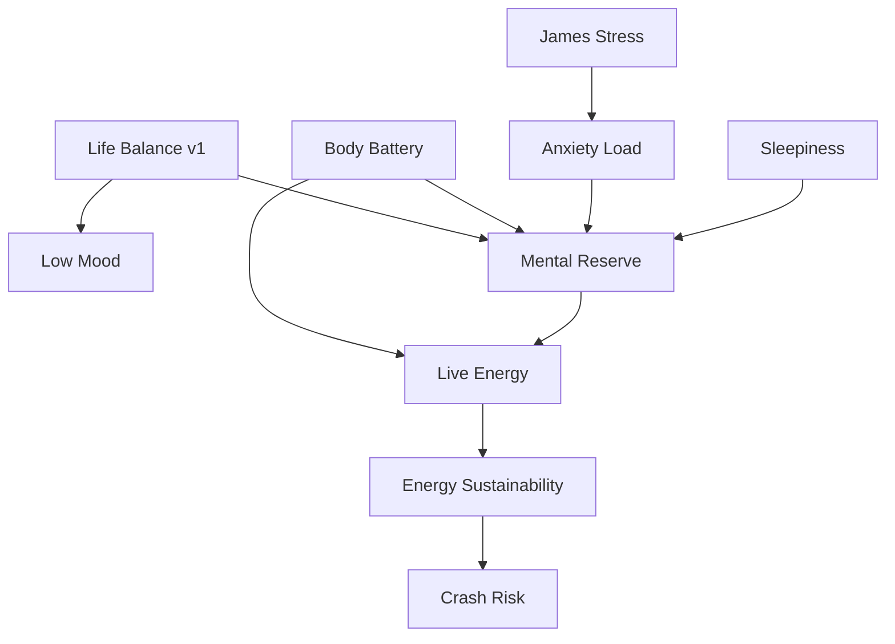

# James OS RUT → Life Balance Succession Audit

Audit date: 2026-09-16  
Scope: current `main`, including the retained native RUT implementation, import/backup paths, Time Ownership, Places/Visits, Activity, interruption handling, derived-score registry and tests. The original audit was architecture/design; the implementation status below records the subsequently shipped v2 boundary.

## Life Balance v2 implementation status — 2026-09-16

**Implemented: `life_balance_v2` algorithm v2.0.0.** The current Life Balance UI now uses a deterministic, bounded 0–100 alignment model over 7-, 28- and 90-day windows. The 28-day window is the primary state once it meets the evidence gate; otherwise the eligible 7-day window remains `LEARNING`. The calculation uses only OwnershipPeriod/Visit ownership precedence plus interruption continuity. It explicitly exposes Autonomous, Committed, Constrained, Work, Unknown, classified ownership, observed-window coverage, interruption duration/count and longest Autonomous block.

The v2 gate requires meaningful confirmed classified ownership plus enough covered time in its selected horizon. `UNKNOWN` reduces coverage and confidence only; it has no negative score contribution. Work and Committed time are presented as factual distribution, not automatic penalties. A small bounded fragmentation term cannot outweigh ownership distribution. Place, GPS, Activity labels, routines, health, Low Mood, Time Pressure and Legacy RUT are non-inputs.

Life Balance v1.0.1 remains preserved and is still the explicit compatibility calculation for Low Mood v1.3.1 and Mental Reserve. Installing v2 therefore does not change either downstream score. v2 is deliberately rebuilt from the bounded factual route snapshot rather than persisted as a derived record: this is idempotent, uses existing backup/import facts, needs no Room migration or backfill, and cannot create a derived-state invalidation loop.

Normal UI now says **Life Balance**. The retained RUT screen is labelled **Legacy RUT history** and its event ledger/templates/recovery links/import compatibility remain untouched, but it no longer creates new point-led current tracking. Legacy RUT and Balance v1 are separate historical algorithm eras; no chart or score conversion claims numeric equivalence. Direct Balance calibration is registered as `life_balance_v2` with the unambiguous weekly question “How much has your time/life felt like your own?” It becomes available once there is a defensible automatic v2 prediction; direct feedback is stored as prediction-versus-James-rating evidence and never rewrites ownership facts.

## Executive summary

**Yes — Life Balance should become the modern successor to RUT, but only partially and under a new, narrow, versioned contract.** RUT was an event-led, cumulative personal-agency / “getting out of a rut” ledger. Its useful intent overlaps strongly with the modern evidence James OS now has: who controlled time, whether it was interrupted, and what James chose to do. Its old additive points are not a safe engine for current Balance.

The successor must calculate from first-class facts, not from `legacyRutScore`:

`Visit/place (where/when) → Activity (what) → Time Ownership (who controlled it) → Interruption (continuity) → Life Balance v2 (longitudinal interpretation)`.

It must not absorb health, mood, GPS coordinates, generic place variety, routines, or activity labels as intrinsic points. A Balance result may therefore legitimately disagree with Low Mood, Recovery, and Time Pressure.

## Historical RUT contract

### What it actually measured

The retained RUT implementation is an **event ledger**, not a passive sensor model. Every `loggedEvents` record is validated, and `Ledger.score(events)` is the simple sum of its signed integer `points`. An initial event is the starting score; positive events add points, negative “Rut Pull” events subtract points, and a recovery event adds positive points but is linked to exactly one prior negative event. Recovery order and one-recovery-per-pull are validated.

The supplied default templates demonstrate the product intent: independence, personal time, boundaries, chosen activity, development, self-directed work, recovery after disrupted plans, avoidance/anxiety, household demands, and interpersonal pressure. Examples include “did something just for me”, “protected my own downtime”, “said no”, “wanted gym but abandoned it because of someone else”, and “home / phone drama took over my day”. This is substantially broader than time logging: it recorded James’s chosen action and the events that undermined it.

RUT has no automatic physiological/provider input, no GPS score, no duration model, no decay, no rolling window, no forecast/possible-score model, and no calibration model. It has a 30-day missed-day review helper and routines/completions, but neither automatically changes the ledger score. `dailyNotes`, milestones, metadata and templates are retained as companion history; only recorded `loggedEvents` points produce the RUT total.

### Verified scale and stages

The actual source has an unbounded signed `Long` total. It does **not** clamp to −1000…+1000, although the historical UI concept uses that familiar range. The verified labels are:

| Score | Stage |
|---:|---|
| ≤ −751 | Deep Rut |
| −750…−501 | Stuck |
| −500…−251 | Fighting It |
| −250…−1 | Climbing Out |
| 0…249 | Breaking Free |
| 250…499 | Momentum |
| 500…749 | Building My Life |
| 750…999 | Thriving |
| ≥ 1000 | Out of the Rut |

There is no formal neutral-point contract beyond the stage boundary: `0` begins “Breaking Free”, not an explicitly calibrated “balanced life” state. This alone makes it unsuitable to be silently relabelled as Balance.

### Historical data inventory and preservation

The RUT v1/v2 importer accepts six stores: `settings`, `eventTemplates`, `loggedEvents`, `dailyNotes`, `milestones`, and `metadata`. It validates source schema, row identity, dates, templates, the complete ledger and recovery linkage before preview; import is idempotent by `(store, recordId)`, refuses a second initial event, retains conflicts rather than overwriting current rows, and exports the same records through the normal backup. Original bytes and pre-import snapshots are retained app-privately by the established Import Centre.

| Data | Present in James OS after import | Meaning / provenance |
|---|---|---|
| Initial score and signed event ledger | Yes, `loggedEvents` | Original RUT event ID, title, category, timestamp/local date, point value, type, note, template link and recovery link when present. |
| Templates/default definitions | Yes, `eventTemplates` | User/default template metadata, points, category, enabled/order and optional recovery definition. |
| Recovery relationship | Yes | `linkedEventId`; ledger validation preserves one recovery per negative pull. |
| Daily notes / day review | Yes, `dailyNotes` / `metadata` | Historical note and review status; no point inference. |
| Settings, milestones and unknown source fields | Yes where part of imported raw rows | Preserved raw through Room/backup compatibility paths. |
| Passive RUT readings, forecasts or predictions | No separate model found | No record kind or calculation exists in the inspected native source. Do not invent one. |
| Data only in the retired app and never exported | Not knowable here | Must remain unavailable rather than fabricated. |

### The reported `RUT −870`

No real James database or RUT backup is present in this public Work repository, so the record-level timestamp and component list for James’s private `−870` cannot truthfully be claimed here. Source establishes exactly what it means if shown: the **current sum of all retained `loggedEvents`**, which maps to **Deep Rut**. It is live in the narrow ledger sense: editing/logging/deleting a RUT event changes the displayed sum. It is not a frozen imported scalar, unless the private ledger contains no later events.

It has **no direct input into Life Balance, Low Mood, Mental Reserve, Time Pressure, or any other current derived score**. Existing tests explicitly assert that a historical negative RUT event neither creates nor rewrites Life Balance. Thus it must never be presented as fresh current state merely because its cumulative total remains visible.

## Current Life Balance v1.0.1 contract

Life Balance is already a materially different model: a bounded rolling `0…100` score for 7, 14 and 28 day windows, anchored to the accepted James-Day/main-sleep boundary rather than midnight. It requires at least 120 minutes of **classified** ownership; otherwise score is `null`/`LEARNING`.

Current input arithmetic is deliberately modest: base 50, up to +18 for Autonomous minutes, up to −12 for Committed minutes, up to −14 for Constrained minutes, and up to −18 for difficult Context intervals; active `life_balance` output-bias calibration is then applied. Work minutes, Unknown minutes, Activity count and interruptions are retained in the window but are not currently scored. The current score is therefore a preliminary ownership/context indicator, not yet a full successor contract.

Ownership uses the authoritative `OwnershipPeriod` clock in priority over enclosing `PlaceVisit` ownership. Exact interval edges select one winner and prevent double counting. `AUTONOMOUS`, `COMMITTED`, `CONSTRAINED`, `WORK`, and `UNKNOWN` are distinct. Unknown is evidence quality, never negative personal-time inference. Interruptions split autonomous continuity, retain count/duration/longest autonomous block, and do not create a second ownership clock.

Current v1 limitations that rule out calling it RUT replacement already:

* It does not use ownership **proportions**, waking-time coverage or fragmentation in the score.
* It currently counts difficult context in Balance; that is potentially a context proxy rather than ownership/alignment itself.
* It exposes “Chosen activities” in metadata, but activities do not currently contribute to the score; this is correct until semantics are evidenced.
* `Personal`/`Autonomous`, `Committed`, `Constrained`, `Work` and `Unknown` are available as facts, but only some affect v1 arithmetic.
* The v1 description says it “evolves Rut,” which overstates numeric continuity.

## RUT versus Life Balance

| Concept | Historical RUT | Life Balance v1 | Better first-class evidence now? | Future Balance v2 |
|---|---|---|---|---|
| Agency/autonomy | Directly event-coded | Autonomous minutes | Yes, OwnershipPeriod | Core, factual and duration-aware |
| Personal/chosen time | Points for self-directed activity/downtime | Autonomous minutes; weak activity metadata | Yes | Core, but activity is contextual not required |
| Obligations/work | Points sometimes penalised/credited | Committed scored; Work retained | Yes, Shift Tracker can improve Work evidence | Proportion/context; not automatic punishment |
| Constrained-but-not-busy time | Event-coded pressures | First-class Constrained ownership | Yes | Core, distinct from Time Pressure |
| Interruptions / lost plans | Negative event/recovery pair | Stored, only continuity summary | Yes | Explain fragmentation; no arbitrary points yet |
| Recovery/resilience | Explicit recovery events | No equivalent score component | Partly; retain as Legacy RUT history | Historical/contextual only unless future direct evidence proves value |
| Activity / hobbies / rest | Points per template | Activity record exists | Yes | Context of autonomous time, never moral points |
| Place/GPS | No automatic scoring | Visit/Place exists | Yes | Establish where/when only |
| Routines/self-care | Some positive/negative templates | Routines separate | Yes | Do not reward blindly |
| Mood / health | Some event templates mention anxiety | Separate models | Yes | Explicit non-inputs |
| Unknown/unobserved time | Blank days/review state | First-class Unknown + coverage | Yes | Lowers confidence, never score |

## Current “Rut” Low Mood label finding

The Low Mood implementation does **not** consume the legacy RUT ledger. `mentalWellbeing()` obtains `lifeBalance(records)` and, when the legacy preference gate is enabled, adds only `(50 − currentLifeBalance)/3`, bounded to ±10. It explicitly explains that historical RUT points remain historical records. The registry dependency graph likewise lists `low_mood_load → life_balance`, not `rut`.

The displayed Low Mood input list still says `Rut`, the preference key/UI says `Use Rut`, and some older documentation describes “Rut direction.” These are stale migration-era metadata names. They are not evidence of a hidden RUT → Low Mood feed. This audit includes a narrowly scoped metadata correction so current algorithm detail says **Life Balance**; the persisted preference key is retained for upgrade compatibility and continues to gate the same bounded Life Balance contextual input. No score, coefficient, record or calibration changes are made.

## Derived-score dependency graph

Other declared edges are: `Body Battery → Live Energy/Energy Sustainability/Crash Risk`, `Mental Reserve → Energy Sustainability/Crash Risk`, `Sleepiness → Live Energy/Energy Sustainability/Crash Risk`, and `James Stress → Mental Reserve` as a direct contributor. The graph is acyclic.

Risk: Life Balance currently reaches both Low Mood and Mental Reserve. A richer Balance must remain ownership/context only: it must not import sleep, HRV, Recovery, mood, or generic activity “goodness,” because those already reach downstream models through other routes. Low Mood’s future use must stay bounded and version-normalised; a `−1000…+1000` v2 number can never be fed into today’s `(50-score)/3` transform.

## Proposed Life Balance v2 product contract

**“Over a sufficiently covered recent period, how aligned was James’s observed waking time with time he chose and values, versus time that was committed, constrained or fragmented?”**

It is not happiness, Low Mood, depression, physical health, Recovery, productivity, Time Pressure, or an assessment of whether James’s life is good. Work, care and obligations can coexist with strong Balance. Chosen rest, gaming, coding, cinema, walking, or deliberately doing nothing can all be Autonomous. Home, gym, cinema, more places, social activity, self-care and exercise have no intrinsic score.

### Recommended representation and scale

Use a bounded internal component model first. It should emit ownership distribution, coverage, autonomous-continuity/fragmentation facts, and a bounded latent alignment value. Only then map it to a display scale.

Recommend **MODIFY** rather than immediately adopting raw `−1000…+1000`: use it as an optional future **display** scale only if usability testing shows bands plus a rounded number improves explanation. `0` should mean a defined neutral ownership/alignment reference, not a claim that life is fine and not merely James’s historically constrained baseline. Endpoints must mean construct extremes, not “perfect/bad life.”

Candidate designs:

| Approach | Strength | Risk | Decision |
|---|---|---|---|
| Fixed weighted ownership proportions | Explainable; avoids raw-minute bias | Weights require validation | Start here, with no production weights in this audit |
| Personal-baseline deviation | Detects meaningful change for James | Can normalise chronic constraint as “normal” | Add later as secondary contextual comparison |
| Bounded component model | Can expose ownership, coverage and fragmentation separately | More design work | Preferred internal architecture |
| Legacy RUT as input | Historical continuity | Opaque, double-counts/false equivalence | Reject |

Use observed waking time as denominator where a defensible James-Day/sleep boundary exists. Report both observed waking time and classified ownership time; `UNKNOWN`/unobserved time reduces coverage/confidence, never alignment. Score bands rather than fake precision when coverage is low.

### Semantics of evidence

* **Time Ownership:** primary factual evidence. Manual correction is authoritative until edited; passive inference never overrides it.
* **Visits/Places:** establish where and when. A cinema/home/work visit is not a Balance point and does not determine ownership.
* **Activity:** establishes what happened. It can explain how Autonomous time was used but cannot be required for chosen rest or treated as inherently positive/negative.
* **Interruptions:** preserve count, duration, fraction of Autonomous time fragmented and longest uninterrupted Autonomous block. They explain continuity; v2 weights require future validation.
* **Committed/Work:** neither automatically bad. Consider amount, proportion, autonomy opportunity and fragmentation rather than a minute-for-point penalty. Shift Tracker can later provide objective Work ownership evidence without judging Domino’s work.
* **Unknown:** first-class missing evidence. Never promote to Personal/Constrained/Committed because no obligation was detected.
* **Health, mood, stress, anxiety, Time Pressure:** non-inputs. Future Insights may correlate them but Balance must be able to disagree with them.
* **WHOOP/Health Connect/Windows companion:** future objective Activity evidence only. HR zones, PC/gaming/coding sessions and sensor data do not themselves earn Balance points.

### Horizons, trend, confidence

Today should remain descriptive facts. A 7-day view may support a provisional short-term state; 28 days is the recommended primary Balance state; 90 days becomes a trajectory only after enough coverage. Do not let one afternoon rewrite a 28-day interpretation. Trend compares version-compatible sufficiently covered windows, and should be omitted/learning where coverage is inadequate.

## Synthetic examples and anti-examples

| Day | Expected factual interpretation | Balance implication |
|---|---|---|
| Mostly Autonomous | Confirmed chosen/rest time, low unknown | Strong alignment evidence; not proof of happy mood |
| Work-heavy, otherwise balanced | Work ownership plus protected autonomous blocks | May be balanced; work is not an automatic penalty |
| Heavily constrained | Confirmed constrained ownership dominates | Lower alignment if coverage is adequate |
| High Unknown | Little classified ownership | Insufficient/low confidence, not negative |
| Autonomous but interrupted | Personal time repeatedly interrupted | Preserve fragmentation separately; do not double-count minutes |
| Restful day at home | Confirmed deliberate Autonomous rest | Valid autonomous time; home is not negative |
| Busy chosen day | Many chosen activities with Autonomous ownership | May support alignment; activity count alone does not |
| No deadline, anticipatory constraint | James confirms Constrained ownership | Constrained, while Time Pressure can remain low |

Anti-examples: gym ≠ good Balance; home ≠ bad; work ≠ bad; cinema ≠ Personal; no activity ≠ bad; lots of activity ≠ good; no deadline ≠ Personal; Low Mood ≠ bad Balance; good Recovery ≠ good Balance.

## Historical continuity and migration

Keep **Legacy RUT era** and **James OS Balance era** as separate labelled series. Preserve every ledger event, template, recovery link, source timestamp and original score semantics. Do not draw one seamless numerical chart, convert RUT points to v2, or treat RUT −870 and Balance −870 as mathematically equivalent. A future Insights view may display separate eras with a migration marker and explanatory text.

Proposed safe v2 stages:

1. Define `LifeBalanceV2` output schema/version and immutable calculation trace; retain v1 outputs.
2. Aggregate OwnershipPeriod/Visit/Interruption facts by James Day with deterministic interval precedence and coverage.
3. Add confidence/coverage gates and a bounded component model; no RUT or health input.
4. Build concise explanation/details before Today numeric presentation.
5. Preserve Legacy RUT history/era views and import/backup compatibility unchanged.
6. Integrate Today/Insights only after representative synthetic and real-device validation.
7. Add a separately versioned bounded Low Mood compatibility transform only if calibration shows Life Balance adds predictive value.
8. Migration: idempotent, non-destructive, versioned v2 outputs from available modern facts only; no database reset and no historical conversion where facts are absent.

Future test matrix: ownership precedence/no overlap; unknown coverage; cross-midnight James-Day windows; work-heavy/non-penalised; deliberately restful at home; constrained-but-not-busy; interruptions; manual correction propagation; Activity/Place neutrality; coverage-gated trend; v1/legacy preservation; backup/restore; and evidence that v2 does not change Low Mood until an explicitly versioned integration is approved.

## Decision

| Question | Decision |
|---|---|
| Should Life Balance succeed RUT? | **YES, partially:** successor in purpose, not a numeric rename or point-led clone. |
| Use −1000…+1000? | **MODIFY:** optional display range after testing; internal bounded components first. |
| Legacy RUT directly feed Balance? | **NO.** |
| Preserve Legacy RUT history? | **YES.** |
| Retire “Rut” from current normal algorithm UI? | **YES;** retain “Legacy RUT” for history/import. |
| Should Low Mood use Balance? | **BOUNDED / future version:** current bounded v1 context remains, any v2 conversion requires validation. |
| GPS directly score Balance? | **NO.** |
| Activity directly score Balance? | **CONTEXTUAL only; no intrinsic points.** |
| Health metrics score Balance? | **NO.** |

## Recommendation

Approve a bounded **Life Balance v2 design implementation only after review**, using factual ownership/coverage/continuity as the engine and preserving Legacy RUT as historical context. Do not implement it in this task. The immediate safe correction is to stop showing stale “Rut” as a current Low Mood input where the source actually uses Life Balance.
